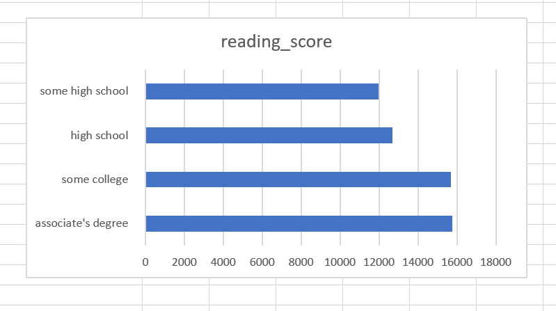

# Madhu Babu-Map-Reduce-Student_Performance
- Learing the map-reduce for Python datasets

# Data Set Reference 
- I have taken data set from Kaggle (Student Performace) as a reference(https://www.kaggle.com/spscientist/students-performance-in-exams). The data is based on the student performace of their reading scores by the degress in schools.
- The data is collected from students performaces of differnt gender of various cities by parental level of education  by thier scores like math,reading,writing of thier courses in different types of degrees of 1000 students. I reduce all the key value pairs for parental level of education, reading scores
# PowerShell Command
- cat StudentsPerformance.csv | python 21mapper.py | sort | python 22reducer.py > konda.txt
# Data Story 
-By the data of student performace.I reduce average of parental level of education( associate's degree,bachelor's degree,high school,master's degree,some college,some high school) by thier Reading scores among all the 1000 records.

-Second I also did the above average for the parental level of education( associate's degree,bachelor's degree,high school,master's degree,some college,some high school) by thier Reading scores among all the 1000 records.

